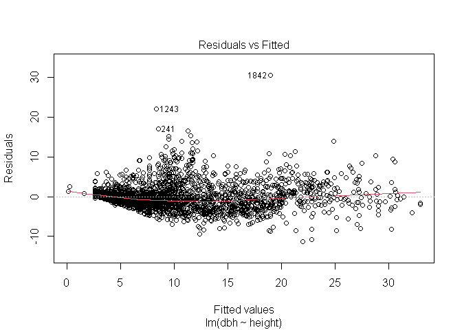
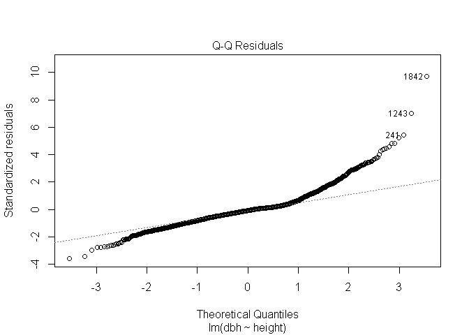
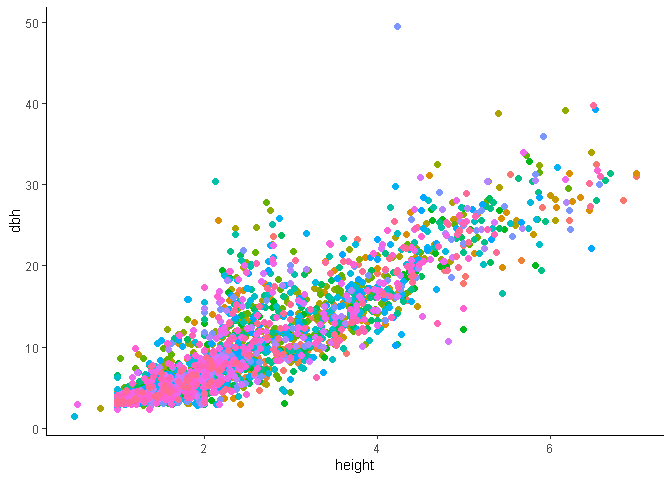

mda_deliverable2
================
Daniel
2023-10-24

# Welcome to the rest of your mini data analysis project!

In Milestone 1, you explored your data. and came up with research
questions. This time, we will finish up our mini data analysis and
obtain results for your data by:

- Making summary tables and graphs
- Manipulating special data types in R: factors and/or dates and times.
- Fitting a model object to your data, and extract a result.
- Reading and writing data as separate files.

We will also explore more in depth the concept of *tidy data.*

**NOTE**: The main purpose of the mini data analysis is to integrate
what you learn in class in an analysis. Although each milestone provides
a framework for you to conduct your analysis, it’s possible that you
might find the instructions too rigid for your data set. If this is the
case, you may deviate from the instructions – just make sure you’re
demonstrating a wide range of tools and techniques taught in this class.

# Instructions

**To complete this milestone**, edit [this very `.Rmd`
file](https://raw.githubusercontent.com/UBC-STAT/stat545.stat.ubc.ca/master/content/mini-project/mini-project-2.Rmd)
directly. Fill in the sections that are tagged with
`<!--- start your work here--->`.

**To submit this milestone**, make sure to knit this `.Rmd` file to an
`.md` file by changing the YAML output settings from
`output: html_document` to `output: github_document`. Commit and push
all of your work to your mini-analysis GitHub repository, and tag a
release on GitHub. Then, submit a link to your tagged release on canvas.

**Points**: This milestone is worth 50 points: 45 for your analysis, and
5 for overall reproducibility, cleanliness, and coherence of the Github
submission.

**Research Questions**: In Milestone 1, you chose two research questions
to focus on. Wherever realistic, your work in this milestone should
relate to these research questions whenever we ask for justification
behind your work. In the case that some tasks in this milestone don’t
align well with one of your research questions, feel free to discuss
your results in the context of a different research question.

# Learning Objectives

By the end of this milestone, you should:

- Understand what *tidy* data is, and how to create it using `tidyr`.
- Generate a reproducible and clear report using R Markdown.
- Manipulating special data types in R: factors and/or dates and times.
- Fitting a model object to your data, and extract a result.
- Reading and writing data as separate files.

# Setup

Begin by loading your data and the tidyverse package below:

``` r
library(datateachr) # <- might contain the data you picked!
library(tidyverse)
library(broom)
```

# Task 1: Process and summarize your data

From milestone 1, you should have an idea of the basic structure of your
dataset (e.g. number of rows and columns, class types, etc.). Here, we
will start investigating your data more in-depth using various data
manipulation functions.

### 1.1 (1 point)

First, write out the 4 research questions you defined in milestone 1
were. This will guide your work through milestone 2:

<!-------------------------- Start your work below ---------------------------->

1.  How does average tree diameter vary by neighborhood?

2.  How does genus distribution vary by neighborhood?

3.  How are size classes distributed among genus (which genus has most
    large trees)?

4.  How does tree diameter vary by height class across species and
    neighborhood?

<!-- -->

    <!----------------------------------------------------------------------------->

Here, we will investigate your data using various data manipulation and
graphing functions.

### 1.2 (8 points)

Now, for each of your four research questions, choose one task from
options 1-4 (summarizing), and one other task from 4-8 (graphing). You
should have 2 tasks done for each research question (8 total). Make sure
it makes sense to do them! (e.g. don’t use a numerical variables for a
task that needs a categorical variable.). Comment on why each task helps
(or doesn’t!) answer the corresponding research question.

Ensure that the output of each operation is printed!

Also make sure that you’re using dplyr and ggplot2 rather than base R.
Outside of this project, you may find that you prefer using base R
functions for certain tasks, and that’s just fine! But part of this
project is for you to practice the tools we learned in class, which is
dplyr and ggplot2.

**Summarizing:**

1.  Compute the *range*, *mean*, and *two other summary statistics* of
    **one numerical variable** across the groups of **one categorical
    variable** from your data.
2.  Compute the number of observations for at least one of your
    categorical variables. Do not use the function `table()`!
3.  Create a categorical variable with 3 or more groups from an existing
    numerical variable. You can use this new variable in the other
    tasks! *An example: age in years into “child, teen, adult, senior”.*
4.  Compute the proportion and counts in each category of one
    categorical variable across the groups of another categorical
    variable from your data. Do not use the function `table()`!

**Graphing:**

6.  Create a graph of your choosing, make one of the axes logarithmic,
    and format the axes labels so that they are “pretty” or easier to
    read.
7.  Make a graph where it makes sense to customize the alpha
    transparency.

Using variables and/or tables you made in one of the “Summarizing”
tasks:

8.  Create a graph that has at least two geom layers.
9.  Create 3 histograms, with each histogram having different sized
    bins. Pick the “best” one and explain why it is the best.

Make sure it’s clear what research question you are doing each operation
for!

<!------------------------- Start your work below ----------------------------->

**1.2**

Before diving in, we will use select() to narrow data down to columns of
interest, just for ease of work.

``` r
trees <- vancouver_trees
trees_tbl <- select(vancouver_trees, genus_name, diameter, neighbourhood_name, common_name, date_planted, height_class = height_range_id)
top_n(trees_tbl, 5)
```

    ## # A tibble: 12 × 6
    ##    genus_name  diameter neighbourhood_name common_name date_planted height_class
    ##    <chr>          <dbl> <chr>              <chr>       <date>              <dbl>
    ##  1 ULMUS          45    KITSILANO          AMERICAN E… NA                     10
    ##  2 ULMUS          35.5  KITSILANO          AMERICAN E… NA                     10
    ##  3 ROBINIA         3    MARPOLE            GLOBE OR M… 1998-01-06             10
    ##  4 QUERCUS        50    KENSINGTON-CEDAR … RED OAK     NA                     10
    ##  5 QUERCUS        42    KENSINGTON-CEDAR … RED OAK     NA                     10
    ##  6 THUJA          38.5  KERRISDALE         WESTERN RE… NA                     10
    ##  7 ACER            6.25 SHAUGHNESSY        RED JAPANE… NA                     10
    ##  8 PSEUDOTSUGA    39.5  RENFREW-COLLINGWO… DOUGLAS FIR NA                     10
    ##  9 PSEUDOTSUGA    35    RILEY PARK         DOUGLAS FIR NA                     10
    ## 10 PSEUDOTSUGA    42    DUNBAR-SOUTHLANDS  DOUGLAS FIR NA                     10
    ## 11 ABIES          25    DUNBAR-SOUTHLANDS  HARVEST OR… NA                     10
    ## 12 POPULUS        48    ARBUTUS-RIDGE      BLACK COTT… NA                     10

**1. How does average tree diameter vary by neighborhood?**

For this analysis we will use **summarizing task 1** to determine
summary statistics of DBH across the different neighborhoods.

``` r
#calculating mean, range, median, and std.dev. across neighborhoods
trees_summary <- trees_tbl %>% 
group_by(neighbourhood_name) %>% 
  summarize(dbh_avg = mean(diameter), dbh_median = median(diameter), dbh_sd = sd(diameter), dbh_range = max(diameter))
```

Nice. Our table of summary statistics is useful for getting an idea of
the diameter distribution by neighbourhood, but to get a visual
understand of this relationship we will first look at histograms and
determine the best bin size as in **graphing task 9** together with a
bar chart to help visualize distribution of data.

``` r
#too small
ggplot(trees_summary, aes(dbh_avg))+
  geom_histogram()
```

<!-- -->

``` r
#too big
ggplot(trees_summary, aes(dbh_avg))+
  geom_histogram(bins = 3)
```

<!-- -->

``` r
#that's better, now we can see that we have one neighborhood that is much smaller than the others, and three neighborhoods with quite large avg_dbh, giving the data a slight right skew.
ggplot(trees_summary, aes(dbh_avg))+
  geom_histogram(bins = 7)
```

<!-- -->

Now to determine which neighborhood goes with which mean dbh, we will
plot the data on a bar chart. I am particularly interested in which
neighborhood has the smallest avg_dbh.

``` r
ggplot(trees_summary, aes(x = neighbourhood_name, y = dbh_avg))+
  geom_col(color = "black", fill = "forestgreen")+ 
  scale_x_discrete(label = function(x) stringr::str_trunc(x, 9))+
  theme(axis.text.x = element_text(angle = 90), legend.position = "none")+
  labs(x = "Neighborhood", y = "Diameter", title = "Mean Tree Diameter by Neighborhood")
```

<!-- -->

``` r
#Its downtown! Tiny trees downtown, apparently.
```

**2. How does genus distribution vary by neighborhood?** For this
analysis we will follow the logic of **summary exercise 4** where by
proportion counts of each genus will be determined across neighborhoods

``` r
#creating genus_count table of number of trees for each genus by neighborhood. "other" category created for trees with less than 100 individuals for a given neighborhood.
trees_genus_count <- trees_tbl %>% 
group_by(neighbourhood_name, genus_name) %>% 
  summarize(genus_count = n()) %>% 
mutate(genus_name = case_when(genus_count < 100 ~ "OTHER", TRUE ~ genus_name))

#adding all "other" genus together and adding "proportion" column
trees_genus_count <- trees_genus_count %>% 
  group_by(neighbourhood_name, genus_name)%>% 
  summarize(genus_count = sum(genus_count)) %>%
  mutate(proportion = genus_count/ sum(genus_count)) %>% 
  arrange(neighbourhood_name, genus_count)
```

Here are two plots, the first of which answers the question I was
heading for, using geom_count to represent the distribution of genus
across the neighborhoods, and the second plot details the variance in
distribution of genus around the city, using strategies from **exercises
6, 7, and 8**.

``` r
ggplot(trees_genus_count, aes(x = neighbourhood_name, y = genus_name))+
  geom_count(aes(size = genus_count))+
  scale_x_discrete(label = function(x) stringr::str_trunc(x, 9))+
  theme(axis.text.x = element_text(angle = 90))
```

<!-- -->

``` r
ggplot(trees_genus_count, aes(x = genus_name, y = log(genus_count)))+
  geom_jitter(alpha = .2) + geom_boxplot(alpha = .5) +
  scale_x_discrete(label = function(x) stringr::str_trunc(x, 9))+
  theme(axis.text.x = element_text(angle = 90), legend.position = "none")+
  labs(x = "Genus", y = "log Genus Count", title = "Counts of Tree Genus Sampled by Neighborhood Across Vancouver")
```

<!-- -->

**3. How are trees distributed by size class across genus?** For this
analysis we will start by defining a tree diameter class by converting
diameter into a 4 level categorical variable (sapling, small, medium,
large), as in **exercise 3**. Tree class sizes roughly determined from
Toronto’s size class distributions for urban forestry.

``` r
#creating categories for converting diameter from a numerical variable
trees_tbl <- trees_tbl %>% 
mutate(diameter_class = cut(diameter, breaks = c(0, 7.9, 15.7, 23.6, 100), labels = c("sapling", "small", "medium", "large")))

trees_class <- trees_tbl %>% 
group_by(diameter_class, genus_name) %>%
   summarize(class_count = n()) %>% 
  arrange(desc(class_count))

trees_class %>% 
  group_by(diameter_class) %>% 
  summarize(total_count = sum(class_count))
```

    ## # A tibble: 5 × 2
    ##   diameter_class total_count
    ##   <fct>                <int>
    ## 1 sapling              66041
    ## 2 small                40332
    ## 3 medium               22728
    ## 4 large                17408
    ## 5 <NA>                    92

Most large trees (\>25in) belong to the Prunus genus. This is somewhat
surprising as there are more Acer than Prunus, but a quick look at the
ordered table suggests that most of the Acer trees are fairly young as
they fall into the sapling and small classes, suggesting that a lot of
Acer have been planted in recent years. We will follow up on this in Q4.
For now we will graph the distribution of diameter class to better
visualize size class distribution. The size classes vary broadly, so we
will log the x axis (**exercise 6**) to better visualize the data,
however, that comes at the cost of making the differences in
distribution less intuitive. So this logged graph best serves as means
of exploring the variance of each size class, while the table of
total_count above provides the most interpretable representation of
class distribution across the city.

``` r
ggplot(trees_class, aes(x = diameter_class, y = log(class_count)))+
  geom_jitter(alpha = .2) + geom_boxplot(alpha = .5) +
  scale_x_discrete(label = function(x) stringr::str_trunc(x, 9))+
  theme(axis.text.x = element_text(angle = 90), legend.position = "none")+
  labs(x = "Genus", y = "log Genus Count", title = "Counts of Tree Genus Sampled by Neighborhood Across Vancouver")
```

<!-- -->

**4. How does tree diameter vary by height class across species?**

This one should be pretty straight forward, wider trees tend to be older
and taller, but several factor can play into this relationship such as
species traits, light availability, and edaphic qualities. So first we
will average trees by species (*exercise1*) to make it easier to work
with and to potentially explore species-specific relationships with
dbh-height relationhips later on, and then average by neighborhood to
evaluate.

``` r
#calculating mean, range, median, and std.dev. across species
trees_q4.1 <- trees_tbl %>% 
group_by(common_name) %>% 
  summarize(dbh_avg = mean(diameter), dbh_median = median(diameter), dbh_sd = sd(diameter), dbh_range = max(diameter), height = mean(height_class))

#and across neighborhood
trees_q4.2 <- trees_tbl %>% 
group_by(neighbourhood_name) %>% 
  summarize(dbh_avg = mean(diameter), dbh_median = median(diameter), dbh_sd = sd(diameter), dbh_range = max(diameter), height = mean(height_class))

view(trees_q4.2)
```

We’ve averaged height class, which was essentially a categorical
variable but was representative of numerical quality, so now it is
numerical. We will plot the relationship between these two numerical
variables dbh_avg and height, with geom_point, and stat_smooth, suing
two geom layers as in **exercise 8**.

``` r
#plot across species
ggplot(trees_q4.1, aes(x = height, y = dbh_avg))+
  geom_point(alpha = .5) + stat_smooth(method = "lm", color = "red")+
  labs(x = "Avg Height Class", y = "Avg DBH", title = "DBH of Vancouver Tree Species Increase as Height Class Increases")
```

<!-- -->

``` r
#plot across neighbourhood
ggplot(trees_q4.2, aes(x = height, y = dbh_avg))+
  geom_point(alpha = .5) + stat_smooth(method = "lm", color = "red")+
  labs(x = "Avg Height Class", y = "Avg DBH", title = "DBH of Vancouver Trees by Neighborhood Increase as Height Class Increases")
```

<!-- -->

<!----------------------------------------------------------------------------->

### 1.3 (2 points)

Based on the operations that you’ve completed, how much closer are you
to answering your research questions? Think about what aspects of your
research questions remain unclear. Can your research questions be
refined, now that you’ve investigated your data a bit more? Which
research questions are yielding interesting results?

<!------------------------- Write your answer here ---------------------------->

The summaries and plotting were helpful in understanding the broader
relationships among the data, and while my questions were all pretty
straightforward, the plots and tables provided most of the insight
necessary for answering the questions. However, so much of the data in
this dataframe is categorical so it has been difficult to visualize
trends as I would if I were able to make scatterplots with regression
lines. For the remainder of the exercise I will likely investigate the
relationship between tree diameter and height further. It is
particularly interesting when considering these variables as products of
different groups such as neighborhood or species or genus.

<!----------------------------------------------------------------------------->

# Task 2: Tidy your data

In this task, we will do several exercises to reshape our data. The goal
here is to understand how to do this reshaping with the `tidyr` package.

A reminder of the definition of *tidy* data:

- Each row is an **observation**
- Each column is a **variable**
- Each cell is a **value**

### 2.1 (2 points)

Based on the definition above, can you identify if your data is tidy or
untidy? Go through all your columns, or if you have \>8 variables, just
pick 8, and explain whether the data is untidy or tidy.

<!--------------------------- Start your work below --------------------------->

``` r
top_n(trees_tbl, 5)
```

    ## # A tibble: 17,408 × 7
    ##    genus_name diameter neighbourhood_name  common_name date_planted height_class
    ##    <chr>         <dbl> <chr>               <chr>       <date>              <dbl>
    ##  1 CATALPA        30   KITSILANO           COMMON CAT… NA                      6
    ##  2 POPULUS        37   FAIRVIEW            BLACK COTT… NA                      3
    ##  3 PRUNUS         37   MARPOLE             KWANZAN FL… NA                      3
    ##  4 CORNUS         42   HASTINGS-SUNRISE    PACIFIC DO… NA                      2
    ##  5 ROBINIA        28   DUNBAR-SOUTHLANDS   BLACK LOCU… NA                      6
    ##  6 ACER           30.8 SHAUGHNESSY         NORWAY MAP… NA                      4
    ##  7 AESCULUS       39   GRANDVIEW-WOODLAND  COMMON HOR… NA                      6
    ##  8 THUJA          30   DUNBAR-SOUTHLANDS   WESTERN RE… NA                      6
    ##  9 TILIA          26   SHAUGHNESSY         BASSWOOD    NA                      5
    ## 10 THUJA          25   RENFREW-COLLINGWOOD WESTERN RE… NA                      5
    ## # ℹ 17,398 more rows
    ## # ℹ 1 more variable: diameter_class <fct>

My dataframe is tidy!! Each row is an observation that pairs across all
columns, every column is a unique variable, and each cell is a unique
value. “genus_name” lists the genus of the tree being sampled in that
row. “diameter” lists the diamter of the tree being sampled in that
row.”neighbourhood_name” lists the neighborhood where the tree was
sampled for that row. “common name” lists the species common name for
that row. “date_planted” has a lot of NAs but when it does have a date,
that date is in fact the planting date for the tree being sampled in
that row. “height_class” lists the height as a categorical level for the
tree specific to that row. Last, but certainly no least,
“diameter_class”, maybe the tidyest of all, breaks diameter down into
categorical levels, one observation per row.

<!----------------------------------------------------------------------------->

### 2.2 (4 points)

Now, if your data is tidy, untidy it! Then, tidy it back to it’s
original state.

If your data is untidy, then tidy it! Then, untidy it back to it’s
original state.

Be sure to explain your reasoning for this task. Show us the “before”
and “after”.

<!--------------------------- Start your work below --------------------------->

I’m untidying my data now, because you told me to: I will use the
pivot_wider function to spread my data out all over the place into an
untidy heap.

``` r
#using pivot wider on neighbourhood name to that each neighborhood has its own column
trees_wide <- trees_tbl %>% 
  pivot_wider(names_from = neighbourhood_name, values_from = diameter)

#since each observation in this table is a unique tree, making sense of an untidy dataset would require getting rid of numerical observations like diameter or date_planted (not numeric, but unique). 
```

Here, if we wanted this untidy df to make any practical sense we can
group_by and remove diameter and date_planted and add a count column to
display how many trees of that genus, species, neighborhood, height
class, and size class occur, and then pivot wider by neighborhood with
values from count so each row represents how many times a tree of a
given species of a given height and diameter class occurs in a given
neighborhood. This brings the df from 150,000 rows to 5,000 rows without
sacrificing much data.

``` r
trees_tbl %>% 
  group_by(genus_name, common_name, neighbourhood_name, height_class, diameter_class) %>% 
  summarize(count = n()) %>% 
  pivot_wider(names_from = neighbourhood_name, values_from = count)
```

    ## # A tibble: 4,732 × 26
    ## # Groups:   genus_name, common_name, height_class [2,393]
    ##    genus_name common_name height_class diameter_class KITSILANO
    ##    <chr>      <chr>              <dbl> <fct>              <int>
    ##  1 ABIES      ALPINE FIR             3 sapling                1
    ##  2 ABIES      BALSAM FIR             4 small                 NA
    ##  3 ABIES      BALSAM FIR             6 medium                NA
    ##  4 ABIES      BALSAM FIR             2 sapling               NA
    ##  5 ABIES      BALSAM FIR             6 large                 NA
    ##  6 ABIES      BALSAM FIR             1 sapling                1
    ##  7 ABIES      BALSAM FIR             4 medium                NA
    ##  8 ABIES      GRAND FIR              2 sapling               NA
    ##  9 ABIES      GRAND FIR              4 large                 NA
    ## 10 ABIES      GRAND FIR              5 medium                NA
    ## # ℹ 4,722 more rows
    ## # ℹ 21 more variables: `DUNBAR-SOUTHLANDS` <int>, `GRANDVIEW-WOODLAND` <int>,
    ## #   `HASTINGS-SUNRISE` <int>, KERRISDALE <int>, `RENFREW-COLLINGWOOD` <int>,
    ## #   STRATHCONA <int>, `WEST POINT GREY` <int>, `ARBUTUS-RIDGE` <int>,
    ## #   FAIRVIEW <int>, `KENSINGTON-CEDAR COTTAGE` <int>, MARPOLE <int>,
    ## #   `MOUNT PLEASANT` <int>, OAKRIDGE <int>, `RILEY PARK` <int>,
    ## #   SHAUGHNESSY <int>, `SOUTH CAMBIE` <int>, SUNSET <int>, DOWNTOWN <int>, …

Now I’ll pivot_longer from the original trees_wide df to get my nice,
tidy data back. Using pivot_wider with diameter as the input for
values_from resulted in lists c() in the cells that contained multiple
trees of the same species, neighborhood, height and diameter class. So
converting back would involve converting those lists into numeric data
or something but I’ve spent too long on this already so I’m just going
to resume with my clean data. Cheers.

``` r
trees_long <- trees_wide %>% 
  pivot_longer(cols = "MARPOLE":"SOUTH CAMBIE", names_to = "neighborhood", values_to = "dbh")
```

<!----------------------------------------------------------------------------->

### 2.3 (4 points)

Now, you should be more familiar with your data, and also have made
progress in answering your research questions. Based on your interest,
and your analyses, pick 2 of the 4 research questions to continue your
analysis in the remaining tasks:

<!-------------------------- Start your work below ---------------------------->

1.  **How does average tree diameter vary by neighborhood?**
2.  **How does tree diameter vary by height class?**

<!----------------------------------------------------------------------------->

Explain your decision for choosing the above two research questions.

<!--------------------------- Start your work below --------------------------->

1.  I am interested in looking at tree diameter over the neighborhoods
    as I was quite surprised by the relationship. I did not expect for
    the trees downtown to be almost twice as small in diameter as the
    trees in Kits and I am curious what else there is to that
    relationship. I think that digging more into the species composition
    and the time of planting could be really interesting to parse out
    why the tree DBH is so different. Are the downtown trees younger or
    are they of a slower growing species, or is it decreased light
    availability due to the buildings?

2.  Looking at tree diameter by height class is appealing because it is
    very similar to the work I do in my own research. Typically, I
    evaluate the relationship between two continuous variable and I am
    more comfortable with data analysis for linear regression. I am
    interested to see how this relationship changes when samples are
    isolated by neighbourhood or by species. This analysis may require
    mixed effects with random effects for the neighborhoods which are
    clearly not independent of one another.
    <!----------------------------------------------------------------------------->

Now, try to choose a version of your data that you think will be
appropriate to answer these 2 questions. Use between 4 and 8 functions
that we’ve covered so far (i.e. by filtering, cleaning, tidying,
dropping irrelevant columns, etc.).

(If it makes more sense, then you can make/pick two versions of your
data, one for each research question.)

<!--------------------------- Start your work below --------------------------->

For each research question we should be able to work with a table
similar to the one created in answering q4 (from step 1.2). I will
recreate the body of the table here, but several more functions were
used in data manipulation throughout question 1:

``` r
#first we will get the table that we want to work with all clean and nice.

#creating trees_analysis table of number of trees for each species by neighborhood. "other" category created for trees with less than 10 individuals for a given neighborhood.
trees_analysis <- trees_tbl %>% 
  group_by(common_name, neighbourhood_name) %>% 
  summarize(dbh = mean(diameter), height = mean(height_class), species_count = n()) %>% 
mutate(common_name = case_when(species_count < 10 ~ "OTHER", TRUE ~ common_name))


#adding all "other" species together and adding "proportion" column
trees_analysis <- trees_analysis %>% 
  group_by(neighbourhood_name, common_name)%>% 
  summarize(species_count = sum(species_count), dbh = mean(dbh), height = mean(height)) %>%
  mutate(proportion = species_count/ sum(species_count)) %>%
  arrange(neighbourhood_name, species_count)

trees_analysis
```

    ## # A tibble: 2,473 × 6
    ## # Groups:   neighbourhood_name [22]
    ##    neighbourhood_name common_name          species_count   dbh height proportion
    ##    <chr>              <chr>                        <int> <dbl>  <dbl>      <dbl>
    ##  1 ARBUTUS-RIDGE      BAILEY SELECT CHOKE…            10  3      1       0.00193
    ##  2 ARBUTUS-RIDGE      BIGLEAF MAPLE                   10 31.0    7       0.00193
    ##  3 ARBUTUS-RIDGE      DEODAR CEDAR                    10 22.5    5       0.00193
    ##  4 ARBUTUS-RIDGE      WILDFIRE BLACK GUM              10  3      1       0.00193
    ##  5 ARBUTUS-RIDGE      HALKA HONEYLOCUST               11  4.82   1.73    0.00213
    ##  6 ARBUTUS-RIDGE      MAPLE SPECIES                   11 13.7    3.27    0.00213
    ##  7 ARBUTUS-RIDGE      RED OAK                         11 31.3    5.55    0.00213
    ##  8 ARBUTUS-RIDGE      SERVICEBERRY                    11  4.64   2.64    0.00213
    ##  9 ARBUTUS-RIDGE      FERNLEAF BEECH                  12  3      1       0.00232
    ## 10 ARBUTUS-RIDGE      GIANT DOGWOOD                   12  3.17   1.25    0.00232
    ## # ℹ 2,463 more rows

This table is trim and tidy with only the necessary columns for asking
these two research questions. DBH and height class have been averaged by
species within each neighbourhood for ~3000 rows, compared to the
~150,000 of the original data. Ready for modelling.

# Task 3: Modelling

## 3.0 (no points)

Pick a research question from 1.2, and pick a variable of interest
(we’ll call it “Y”) that’s relevant to the research question. Indicate
these.

<!-------------------------- Start your work below ---------------------------->

**Research Question**: How does tree diameter vary by height class?

**Variable of interest**: Diameter

<!----------------------------------------------------------------------------->

## 3.1 (3 points)

Fit a model or run a hypothesis test that provides insight on this
variable with respect to the research question. Store the model object
as a variable, and print its output to screen. We’ll omit having to
justify your choice, because we don’t expect you to know about model
specifics in STAT 545.

- **Note**: It’s OK if you don’t know how these models/tests work. Here
  are some examples of things you can do here, but the sky’s the limit.

  - You could fit a model that makes predictions on Y using another
    variable, by using the `lm()` function.
  - You could test whether the mean of Y equals 0 using `t.test()`, or
    maybe the mean across two groups are different using `t.test()`, or
    maybe the mean across multiple groups are different using `anova()`
    (you may have to pivot your data for the latter two).
  - You could use `lm()` to test for significance of regression
    coefficients.

<!-------------------------- Start your work below ---------------------------->

``` r
#creating a model
lm <- lm(dbh ~ height, data = trees_analysis)
summary(lm)
```

    ## 
    ## Call:
    ## lm(formula = dbh ~ height, data = trees_analysis)
    ## 
    ## Residuals:
    ##      Min       1Q   Median       3Q      Max 
    ## -11.2938  -1.6770  -0.2530   0.8804  30.5093 
    ## 
    ## Coefficients:
    ##             Estimate Std. Error t value Pr(>|t|)    
    ## (Intercept) -2.40967    0.14017  -17.19   <2e-16 ***
    ## height       5.05286    0.05085   99.38   <2e-16 ***
    ## ---
    ## Signif. codes:  0 '***' 0.001 '**' 0.01 '*' 0.05 '.' 0.1 ' ' 1
    ## 
    ## Residual standard error: 3.146 on 2471 degrees of freedom
    ## Multiple R-squared:  0.7999, Adjusted R-squared:  0.7998 
    ## F-statistic:  9875 on 1 and 2471 DF,  p-value: < 2.2e-16

``` r
#residuals look okay but definitely skewed left and probably heteroscedasticity 
plot(lm, which = 1)
```

<!-- -->

``` r
#QQ not great
plot(lm, which = 2)
```

<!-- -->

``` r
#Independent?
(colour_plot <- ggplot(trees_analysis, aes(x = height, y = dbh, color = neighbourhood_name)) +
    geom_point(size = 2) +
    theme_classic() +
    theme(legend.position = "none"))
```

<!-- -->

``` r
#Drop the neighborhoods and Try some transformations
trees_analysis <- trees_tbl %>% 
  group_by(common_name) %>% 
  summarize(dbh = mean(diameter), height = mean(height_class), species_count = n()) %>% 
mutate(common_name = case_when(species_count < 10 ~ "OTHER", TRUE ~ common_name))


#adding all "other" species together and adding "proportion" column
trees_analysis <- trees_analysis %>% 
  group_by(common_name)%>% 
  summarize(species_count = sum(species_count), dbh = mean(dbh), height = mean(height)) %>%
  mutate(proportion = species_count/ sum(species_count)) %>% 
  arrange(species_count)


#Linear Regression
lm <- lm(sqrt(dbh) ~ log(height), data = trees_analysis)


#residuals look way better
plot(lm, which = 1)
```

<!-- -->

``` r
#QQ also much better
plot(lm, which = 2)
```

<!-- -->

``` r
#Looks pretty independent to me
(colour_plot <- ggplot(trees_analysis, aes(x = log(height), y = sqrt(dbh), color = common_name)) +
    geom_point(size = 2) +
    theme_classic() +
    theme(legend.position = "none"))
```

<!-- -->

After much ado, I decided to go with the log transformed height, square
root transformed dbh relationship that only considered common_name
(species) averages. I chose to drop the neighborhoods as they were
leading to failed assumptions in linear regression and as a kicker the
R-squared of this analysis is superior (at .83). This might be more
curvlinear but I’m happy enough.

<!----------------------------------------------------------------------------->

## 3.2 (3 points)

Produce something relevant from your fitted model: either predictions on
Y, or a single value like a regression coefficient or a p-value.

- Be sure to indicate in writing what you chose to produce.
- Your code should either output a tibble (in which case you should
  indicate the column that contains the thing you’re looking for), or
  the thing you’re looking for itself.
- Obtain your results using the `broom` package if possible. If your
  model is not compatible with the broom function you’re needing, then
  you can obtain your results by some other means, but first indicate
  which broom function is not compatible.

<!-------------------------- Start your work below ---------------------------->

``` r
glance(lm)
```

    ## # A tibble: 1 × 12
    ##   r.squared adj.r.squared sigma statistic   p.value    df logLik   AIC   BIC
    ##       <dbl>         <dbl> <dbl>     <dbl>     <dbl> <dbl>  <dbl> <dbl> <dbl>
    ## 1     0.833         0.833 0.404     2105. 6.64e-166     1  -216.  438.  451.
    ## # ℹ 3 more variables: deviance <dbl>, df.residual <int>, nobs <int>

As detailed in the bottom of the summary table we received an Adjusted
R-squared of .83 and a p-value of 5.5 x10^-16, suggesting a very
significant relationship and a well fit regression line.
<!----------------------------------------------------------------------------->

# Task 4: Reading and writing data

Get set up for this exercise by making a folder called `output` in the
top level of your project folder / repository. You’ll be saving things
there.

## 4.1 (3 points)

Take a summary table that you made from Task 1, and write it as a csv
file in your `output` folder. Use the `here::here()` function.

- **Robustness criteria**: You should be able to move your Mini Project
  repository / project folder to some other location on your computer,
  or move this very Rmd file to another location within your project
  repository / folder, and your code should still work.
- **Reproducibility criteria**: You should be able to delete the csv
  file, and remake it simply by knitting this Rmd file.

<!-------------------------- Start your work below ---------------------------->

``` r
library(here)
write.csv(trees_q4.2, file = here::here("output", "trees_output.csv"))
```

<!----------------------------------------------------------------------------->

## 4.2 (3 points)

Write your model object from Task 3 to an R binary file (an RDS), and
load it again. Be sure to save the binary file in your `output` folder.
Use the functions `saveRDS()` and `readRDS()`.

- The same robustness and reproducibility criteria as in 4.1 apply here.

<!-------------------------- Start your work below ---------------------------->

``` r
saveRDS(lm, file = here("output", "lm_output.rds"))
```

``` r
readRDS(here("output", "lm_output.rds"))
```

    ## 
    ## Call:
    ## lm(formula = sqrt(dbh) ~ log(height), data = trees_analysis)
    ## 
    ## Coefficients:
    ## (Intercept)  log(height)  
    ##       1.520        1.931

<!----------------------------------------------------------------------------->

# Overall Reproducibility/Cleanliness/Coherence Checklist

Here are the criteria we’re looking for.

## Coherence (0.5 points)

The document should read sensibly from top to bottom, with no major
continuity errors.

The README file should still satisfy the criteria from the last
milestone, i.e. it has been updated to match the changes to the
repository made in this milestone.

## File and folder structure (1 points)

You should have at least three folders in the top level of your
repository: one for each milestone, and one output folder. If there are
any other folders, these are explained in the main README.

Each milestone document is contained in its respective folder, and
nowhere else.

Every level-1 folder (that is, the ones stored in the top level, like
“Milestone1” and “output”) has a `README` file, explaining in a sentence
or two what is in the folder, in plain language (it’s enough to say
something like “This folder contains the source for Milestone 1”).

## Output (1 point)

All output is recent and relevant:

- All Rmd files have been `knit`ted to their output md files.
- All knitted md files are viewable without errors on Github. Examples
  of errors: Missing plots, “Sorry about that, but we can’t show files
  that are this big right now” messages, error messages from broken R
  code
- All of these output files are up-to-date – that is, they haven’t
  fallen behind after the source (Rmd) files have been updated.
- There should be no relic output files. For example, if you were
  knitting an Rmd to html, but then changed the output to be only a
  markdown file, then the html file is a relic and should be deleted.

Our recommendation: delete all output files, and re-knit each
milestone’s Rmd file, so that everything is up to date and relevant.

## Tagged release (0.5 point)

You’ve tagged a release for Milestone 2.

### Attribution

Thanks to Victor Yuan for mostly putting this together.
